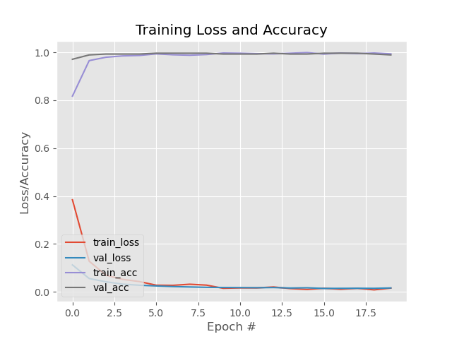
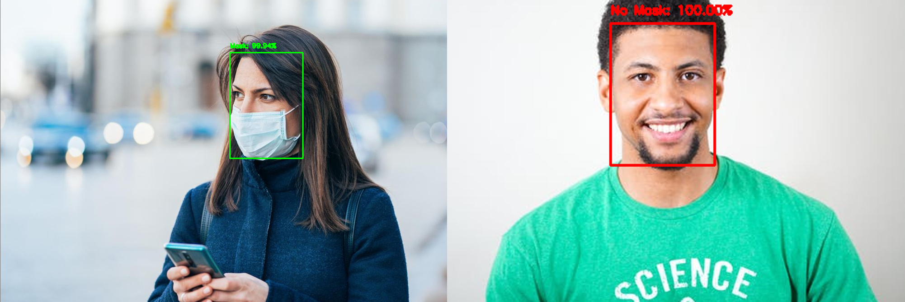

<h1 align="left">
    Nose Mask Checker :mask:
</h1>

A COVID-19 nose mask detector built with OpenCV, Keras/TensorFlow, and Deep Learning.

Trained by fine-tuning the <a href="https://github.com/prajnasb/observations/tree/master/mask_classifier/Data_Generator">MobileNet V2 architecture</a>, a highly efficient architecture that can be applied to embedded devices with limited computational capacity (eg. Raspberry Pi, NVIDIA Jetson Nano, Google Coral ...).

## Installation :package:

1. Clone the repository

```
   $ git clone https://github.com/FredDoe/nose-mask-checker.git
   $ cd nose-mask-checker
```

2. Create virtual environment and install dependencies

```
python -m venv venv

source venv/Scripts/activate

pip install -r requirements.txt

```

## Running the Application :computer:

- To build the mask detector model, open up a shell and issue the following command:

```
python mask_detector_trainer.py --dataset dataset
```

- Implementing the COVID-19 nose mask checker for images with OpenCV

```
python detect_mask_image.py --image test_images/test_01.jpeg
```

- Implementing the COVID-19 nose mask checker for video stream with OpenCV

```
python detect_mask_video.py
```

## Training Evaluation
* COVID-19 noee mask checker training accuracy/loss curves demonstrate high accuracy and little signs of overfitting the data:sweat_smile:.



## Demonstration :movie_camera:

- Mask detection using the COVID-19 nose mask checker:mask:



## References :book:

- <a href="https://github.com/prajnasb/observations">Prajna's GitHub repository</a>
- <a href="https://arxiv.org/abs/1801.04381">MobileNet V2 architecture</a>
- <a href="http://www.image-net.org/">ImageNet</a>

## License :key:

MIT &copy; Godfred Doe
